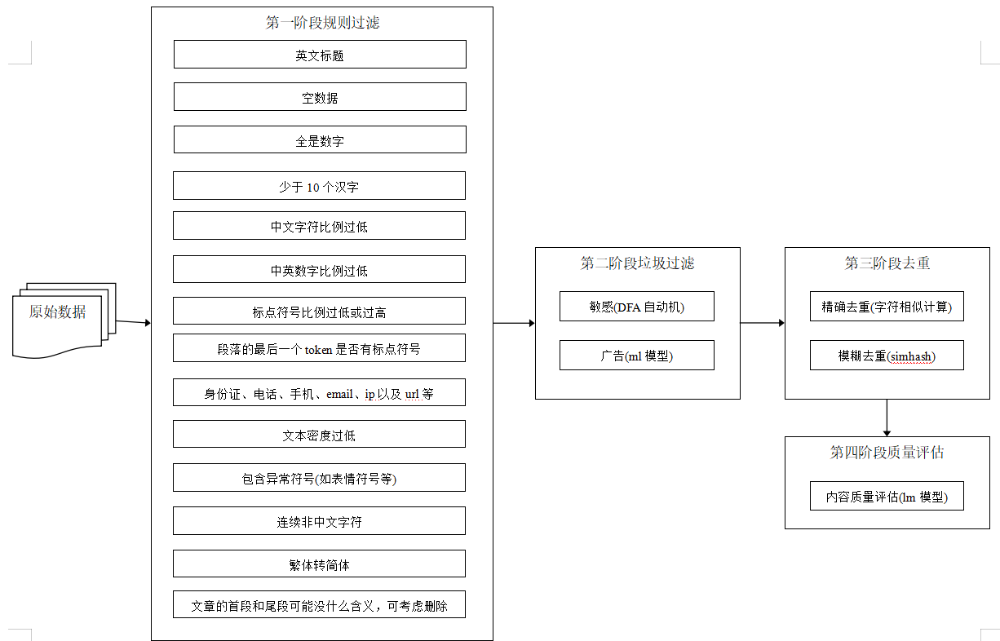

### cleaning of llm corpus 大模型语料清洗

-----------------------------------------------------------------------
数据是人工智能领域发展的基础要素之一。随着大规模预训练模型及相关技术不断取得突破，在相应研究中使用高效数据处理工具提升数据质量变得越来越重要。 
llm_corpus_quality主要包含规则清洗、敏感词过滤、广告词过滤、去重以及语料质量评估等功能在内的多个数据处理方法，为中文大模型的训练提供安全可靠的数据。

Data is one of the fundamental elements of the development of artificial intelligence. With the continuous breakthrough of large-scale pre-training models and related technologies,
it is becoming more and more important to use efficient data processing tools to improve data quality in corresponding research. llm_corpus_quality mainly includes a number of data processing methods, 
including rule cleaning, sensitive word filtering, advertising word filtering, deduplication and corpus quality assessment, which provides safe and reliable data for the training of Chinese large models.

本项目采用java实现。

llm_corpus_quality支持以下特性：

* 规则清洗(rule cleaning)

* 敏感词过滤(sensitive word filtering)

* 广告过滤(advertising word filtering)

* 去重(deduplication)

* 质量评估(corpus quality assessment)
--------------------------------------------------------------------------------
### the overall processing process of the pre-trained corpus of the llm 大模型语料清洗流程

<div align=center>
<br/>
</div>

大模型预训练语料清洗流程，共包括4个阶段5个模块：

Large model pre-training corpus cleaning process, including 4 stages and 5 modules:

1. 规则清洗：利用规则对一些低质量的文本段落进行初步过滤，这些规则主要包括低密度文本、异常符号、中文比例过低等。

rule cleaning: Some low-quality text paragraphs are preliminatively filtered by rules, which mainly include low-density text, abnormal symbols, and low Chinese proportion.          

2. 敏感词过滤器：利用自动机，过滤色情、赌博、敏感等内容的文本。

sensitive word filtering: Filter text for pornography, gambling, sensitive content, etc.                       

3. 广告过滤：利用textcnn模型，过滤涉嫌广告内容。(见https://github.com/jiangnanboy/ad_detect_textcnn)

advertising word filtering:Filter advertising content.                         

4. 去重：利用simhash对相似文本片段进行去重。

deduplication: simhash is used to de-duplicate similar text fragments.

5. 质量评估：采用ngram语言模型评估的方法，对语料进行概率预估，文本质量越高的语句，困惑度ppl越低，设定一个ppl阈值，高于这个阈值为低质量语料，可过滤。

corpus quality assessment: ngram language model evaluation method is used to estimate the probability of corpus. The higher the quality of the text, the lower the confusion ppl. A ppl threshold value is set, higher than this threshold, the low-quality corpus can be filtered.                        

### usage
【src/main/java/com/sy/corpus_quality_main】

* 规则清洗(rule cleaning) -> corpus_quality_process/rule_quality
* 敏感词过滤(sensitive word filtering) -> corpus_quality_process/sensitivity_advertising/sensitivity
* 广告过滤(advertising word filtering) -> corpus_quality_process/sensitivity_advertising/advertising
* simhash去重(deduplication) -> corpus_quality_process/deduplication
* 质量评估(corpus quality assessment) -> corpus_quality_process/quality_evaluation

ngram模型训练(training of ngram model) -> corpus_quality_process/quality_evaluation/ngram，

这里有个训练好的ngram模型(Here's a trained ngram model)，链接：https://pan.baidu.com/s/1VbBF_R6IQfKVNDipNN3QDg 提取码：sy12

``` java
        // hash data of corpus to deduplication (read and save)
        var hashFile = PropertiesReader.get("dedeplication_hash_path");

        //1.rule
        var ruleQuality = new RuleQuality();

        //2.sensitivity and advertising detection
        var simpleSenDetectionProcessor = SimpleSenDetectionProcessor.newInstance();
        var senDetection = simpleSenDetectionProcessor.getKWSeeker("sensitive_words_path");

        var ad_detect_model_path = PropertiesReader.get("ad_detect_model_path");
        var ad_dict_path = PropertiesReader.get("ad_dict_path");
        var stop_words_path = PropertiesReader.get("stop_words_path");
        var adDetection = new AdDetection(ad_detect_model_path, ad_dict_path, stop_words_path);

        //3.text deduplication
        var deDuplication = new DeDuplication(4, 3);

        //4.quality evaluation
        var ngramModelPath = PropertiesReader.get("language_model_path");
        var qualityEvaluation = new QualityEvaluation(ngramModelPath);

        // load hash
        if(Files.exists(Paths.get(hashFile))) {
            deDuplication.loadHash(hashFile);
        }

        var corpusQuality = new CorpusQuality(ruleQuality, senDetection, adDetection, deDuplication, qualityEvaluation, 100);
        var corpus = "对未按土地、环保和投资管理等法律法规履行相关手续或手续不符合规定的违规项目，地方政府要按照要求进行全面清理。一，凡是未开工的违规项目，一律不得开工建设；二，凡是不符合产业政策、准入标准、环保要求的违规项目一律停建。";
        var result = corpusQuality.quality(corpus);
        System.out.println(result);

        // save hash
        deDuplication.saveHash(hashFile);
```

### requirement
java11+

### contact
1、github：https://github.com/jiangnanboy

2、blog：https://www.cnblogs.com/little-horse/

3、e-mail:2229029156@qq.com

### reference
https://openi.pcl.ac.cn/LLM-Research/DataQuality/src/branch/master/DataCollector2

https://github.com/hailin0/sensitive-word-filter

https://github.com/xlturing/Simhash4J

https://github.com/jiangnanboy/java_textcnn_onnx


