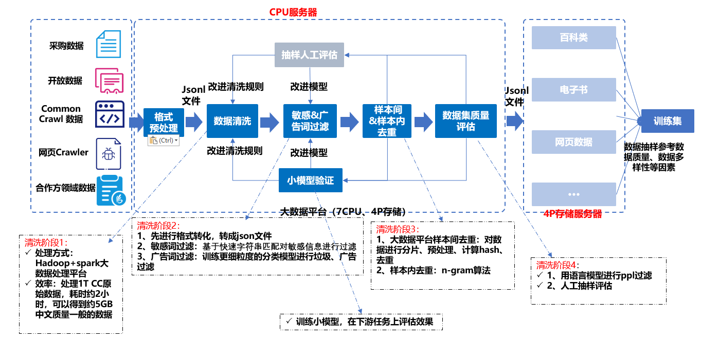

### cleaning of llm corpus

-----------------------------------------------------------------------
数据是人工智能领域发展的基础要素之一。随着大规模预训练模型及相关技术不断取得突破，在相应研究中使用高效数据处理工具提升数据质量变得越来越重要。llm_corpus_quality集成了包含清洗、敏感词过滤、广告词过滤、语料质量自动评估等功能在内的多个数据处理工具与算法，为中文AI大模型提供安全可信的主流数据。

本项目采用java实现。

llm_corpus_quality支持以下特性：

* 规则清洗

* 敏感词过滤

* 广告过滤

* 去重

* 质量评估（待做...）
--------------------------------------------------------------------------------
### the overall processing process of the pre-trained corpus of the llm

 

大模型预训练语料清洗流程，共包括以下5个模块：

1. 语料清洗规则过滤：通常经过格式转换后的json文件仍存在很多问题，不能直接用于构建训练数据集。通常会以句子或篇章作为过滤单位，通过检测句子或篇章内是否含有大量的怪异符号、是否存在html网页标签等来判断文本是否为合格文本
2. 敏感词过滤器：过滤色情、赌博、部分低质量广告等内容的文本
3. 去重：重复粒度可分为样本间、段落间、句子间的重复，按粒度针对性的处理
4. 质量评估：采用自动评估的方法，对语料进行概率预估，文本质量越高的语句，得分越高
5. 人工评估：根据评估手册对语料进行评估，评估等级分为优、良、中、差四个等级

### usage
使用方式见【src/main/java/com/sy/corpus_quality_main】

* 规则清洗 -> corpus_quality_process/rule_quality
* 敏感词过滤 -> corpus_quality_process/sensitivity_advertising/sensitivity
* 广告过滤 -> corpus_quality_process/sensitivity_advertising/advertising
* simhash去重 -> corpus_quality_process/deduplication
* 质量评估（待做...）-> corpus_quality_process/quality_evaluation

### requirement
java11+

### contact
1、github：https://github.com/jiangnanboy

2、blog：https://www.cnblogs.com/little-horse/

3、e-mail:2229029156@qq.com

### reference
https://openi.pcl.ac.cn/LLM-Research/DataQuality/src/branch/master/DataCollector2

https://github.com/hailin0/sensitive-word-filter

https://github.com/xlturing/Simhash4J

https://github.com/jiangnanboy/java_textcnn_onnx

